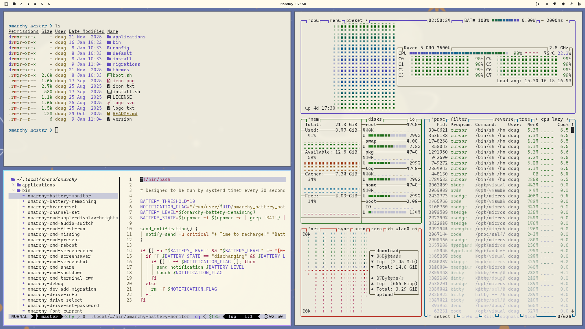

# Alucard for [Omarchy](https://omarchy.org/)

> A light theme for [Omarchy](https://omarchy.org/).



## Install

To install this theme, simply use the `omarchy-theme-install` command:

```bash
omarchy-theme-install https://github.com/douglasdemoura/omarchy-alucard-theme
```

## VS Code theme

You will need to install the Alucard theme manually, as it is not available on the extensions marketplace right now.
As the [Dracula](https://draculatheme.com/spec#implementation-guidelines) specification states, the [Cursor theme](https://github.com/dracula/cursor)
is the reference implementation. Follow the [installation instructions](https://draculatheme.com/cursor), only replacing Cursor with VS Code.

## Team

This theme is maintained by the following person(s) and a bunch of [awesome contributors](https://github.com/dracula/foobar/graphs/contributors).

| [](https://github.com/douglasdemoura) |
|------------------------------------------------------------------------|
| [Douglas Moura](https://github.com/douglasdemoura) |

## Community

- [Twitter](https://twitter.com/draculatheme) - Best for getting updates about themes and new stuff.
- [GitHub](https://github.com/dracula/dracula-theme/discussions) - Best for asking questions and discussing issues.
- [Discord](https://draculatheme.com/discord-invite) - Best for hanging out with the community.

## Dracula PRO

[](https://draculatheme.com/pro)

## License

[MIT License](./LICENSE)
